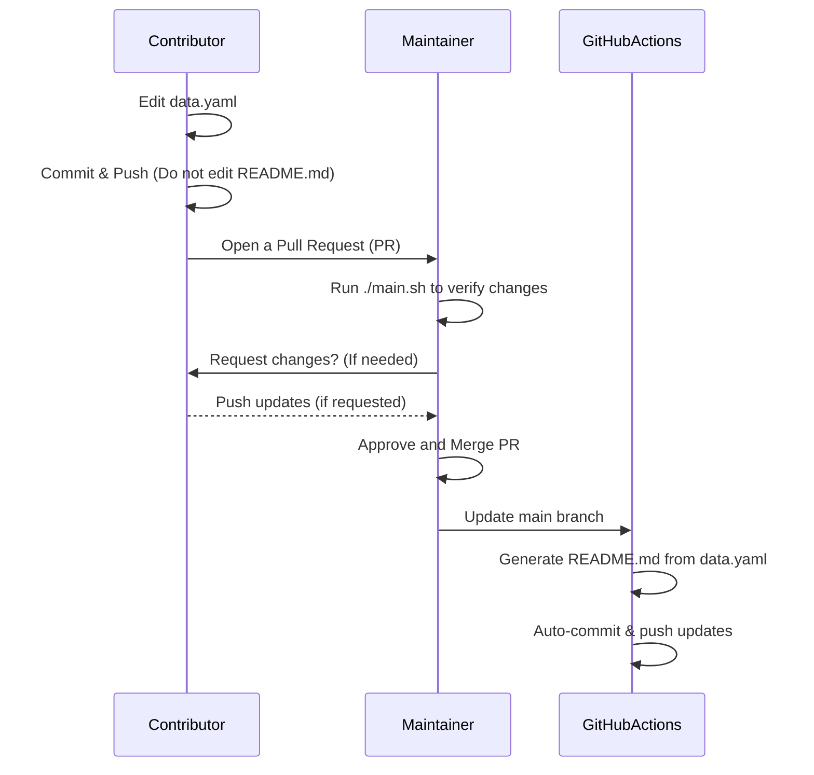

# Contributing

Thank you for your interest in this project!

Please make sure to follow our [Code of Conduct](CODE_OF_CONDUCT.md) in all interactions within this project.

## How to Add an Awesome Item to `README.md`

1. **Modify `generate_readme/data.yaml`**
   - If you are only adding or editing an item, update `generate_readme/data.yaml` **without** modifying `README.md`.
   - Commit your changes and push them to a new branch.

2. **Create a Pull Request (PR)**
   - Once you've pushed your changes, open a PR for review.

## Guidelines

- **Do not manually edit `README.md`**—it is automatically generated.
- Ensure `generate_readme/data.yaml` follows the correct format.
  - Comments within `generate_readme/data.yaml` provide guidelines—refer to them as needed.
- Write clear commit messages and PR descriptions.

## Reference: README.md Auto-Generation Flow

