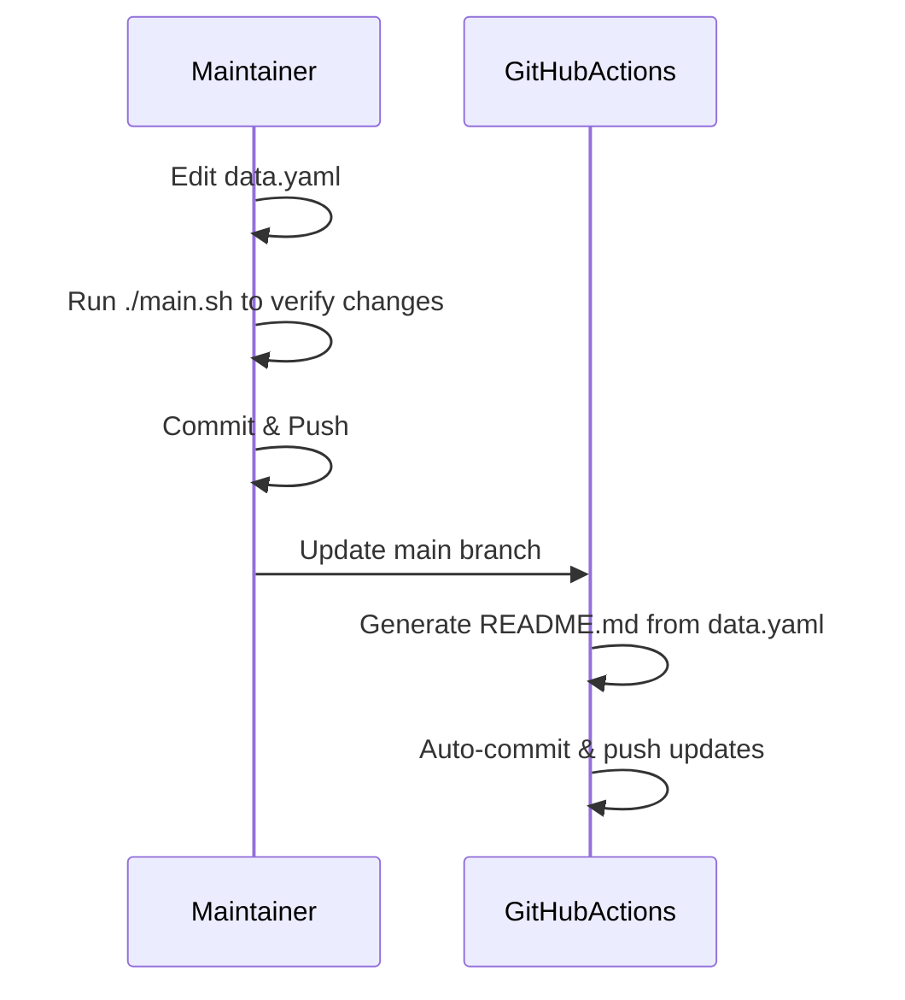

# Contributing

Thank you for your interest in this project!

Please make sure to follow our [Code of Conduct](CODE_OF_CONDUCT.md) in all interactions within this project.

## Our contribution policy

This project is maintained by the core team, and **we do not accept unsolicited external Pull Requests.** Pull requests opened without a prior invitation from the team will be closed without review.

If you'd like to suggest an addition or report an error, please [open an issue](https://github.com/liam-hq/awesome-er-diagrams/issues/new).

## Guidelines

- **Do not manually edit `README.md`**—it is automatically generated.
- Ensure `generate_readme/data.yaml` follows the correct format.
  - Comments within `generate_readme/data.yaml` provide guidelines—refer to them as needed.

## Reference: README.md Auto-Generation Flow

```mermaid
sequenceDiagram
    participant Maintainer
    participant GitHubActions

    Maintainer->>Maintainer: Edit data.yaml
    Maintainer->>Maintainer: Run ./main.sh to verify changes
    Maintainer->>Maintainer: Commit & Push

    Maintainer->>GitHubActions: Update main branch
    GitHubActions->>GitHubActions: Generate README.md from data.yaml
    GitHubActions->>GitHubActions: Auto-commit & push updates
```
